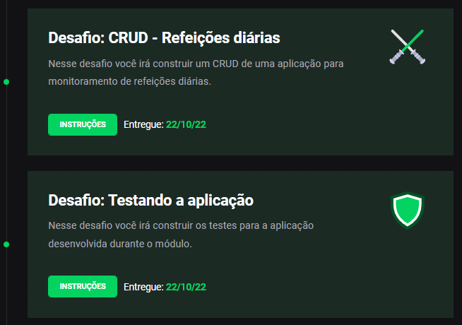

<p align="center">
  
</p>

<h1 align="center">
  Ignite (Elixir) - Rocketseat
</h1>

<h3 align="center">
✅  Chapter III - Desafio 01: CRUD - Refeições diárias
</h3>

<h3 align="center">
✅  Chapter III - Desafio 02: Testando a aplicação
</h3>

</p>

</br>

<blockquote align="center">“Tudo deveria se tornar o mais simples possível, mas não simplificado - Albert Einstein”!</blockquote>

</br>
<p align="center">
  

  <a href="https://www.linkedin.com/in/cleytonalves">
    
  </a>

  

  <a href="https://github.com/cleyton1986/rocketseat-ignite-Elixir-Chapter-III-CRUD-meals/stargazers">
    
  </a>
</p>

<p align="center">
  <a href="#tecnologias-e-recursos">Tecnologias e Recursos</a>&nbsp;&nbsp;&nbsp;|&nbsp;&nbsp;&nbsp;
  <a href="#sobre-o-desafios">Sobre o desafios</a>&nbsp;&nbsp;&nbsp;|&nbsp;&nbsp;&nbsp;
  <a href="#específicação-dos-testes">Especificação de testes</a>&nbsp;&nbsp;&nbsp;|&nbsp;&nbsp;&nbsp;
  <a href="#instalação-e-execução">Instalação e execução</a>&nbsp;&nbsp;&nbsp;|&nbsp;&nbsp;&nbsp;
  <a href="#calendar-entrega">Entrega</a>&nbsp;&nbsp;&nbsp;|&nbsp;&nbsp;&nbsp;
  <a href="#memo-licença">Licença</a>
</p>


## Tecnologias e recursos

- [Elixir](https://elixir-lang.org/install.html)

</br>

## Sobre o desafios

- [Desafio - 01](https://www.notion.so/Desafio-01-CRUD-Refei-es-di-rias-d2911dcc69ee444faea70eec7796546c)
- [Desafio - 02](https://www.notion.so/Desafio-02-Testando-a-aplica-o-435756cc4daf4c9ba490c12642dc5154)

Nesse desafio, você deverá criar uma aplicação para monitoramento de consumo de alimentos durante o dia.

você deverá criar outros testes com o objetivo de completar 100% na cobertura excoveralls. Para isso, utilize a lib do excoveralls, adicione a dependência dele no seu mix.exs e essas configurações.

Se quiser testar a sua implementação a partir do terminal, rode `iex -S mix` dentro do diretório raiz do projeto.

</br>

## Específicação dos testes

Em cada teste, você encontrará uma breve descrição do que sua aplicação deve cumprir para que o teste passe.

Para esse desafio, temos os seguintes testes:

## **Exmeal:**


🧪 ( [Teste test/meals/create_test.exs](https://www.notion.so/Teste-test-meals-create_test-exs-3ca5cd52d3d8442eb61fd47c6d9fd80f) )

🧪 ( [Teste test/meals/delete_test.exs](https://www.notion.so/Teste-test-meals-delete_test-exs-f57b4efbb87748eaabd11f67410f9ba0) )

🧪 ( [Teste test/meals/get_test.exs](https://www.notion.so/Teste-test-meals-get_test-exs-9e6ae254555240278e08668f333249aa) )

🧪 ( [Teste test/meals/update_test.exs](https://www.notion.so/Teste-test-meals-update_test-exs-45ac1a96c03b4a57901579f9667a1bed) )

🧪 ( [Teste /test/exmeal_test.exs](https://www.notion.so/Teste-test-exmeal_test-exs-2b59a7dd54bf4c6584d3df55a53072ff) )


## **ExmealWeb**


### **Controller:**

🧪 (  [Teste /test/exmeal_web/controller/meals_controller_test.exs](https://www.notion.so/Teste-test-exmeal_web-controller-meals_controller_test-exs-aee6b422d7d545a19933190db41d52e3) )

### **View:**

🧪 (  [Teste test/exmeal_web/view/meals_test.exs](https://www.notion.so/Teste-test-exmeal_web-view-meals_test-exs-85e834a00f2d442582bd646ba4b85f2a) )


</br>

## :calendar: Entrega

Esse desafio foi entregue na plataforma Skylab - Rocketseat.
</br>

<p align="center">
  
</p>

## Instalação e execução

### Configuração do ambiente:
<p>
  💿 (
    <a href="https://www.notion.so/Ambiente-de-desenvolvimento-Trilha-Elixir-aa2399b4ec17447582d04cbce8ffa12f">Guia de instalação e configuração do Ambiente - Elixir </a>
  )
</p>
</br>

```bash
# OBS.: ANTES DE PROCEDIMENTO, CERTIFIQUE-SE QUE O ELIXIR ESTEJA INSTALADO NO SEU COMPUTADOR CORRETAMENTE.

# Clone esse repositório
$ git clone https://github.com/cleyton1986/rocketseat-ignite-Elixir-Chapter-III-CRUD-meals

# Entre no diretório
$ cd rocketseat-ignite-Elixir-Chapter-III-CRUD-meals

# baixe as dependencias
$ mix deps.get

# para compilar o projeto, execute o comando
$ mix compile

# para rodar os testes, execute o comando
$ mix test

# para mais detalhes
$ mix test --cover

# acessando o iex
$ iex -S mix

# teste dos métodos usando usando o iex

```
## :memo: Licença

Esse projeto está sob a licença MIT. Veja o arquivo [LICENSE](LICENSE) para mais detalhes.

---

 implementado por 👨🏽‍💻 Cleyton Alves e desenvolvido 💜 by Rocketseat.

